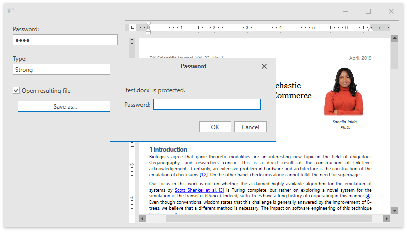

<!-- default badges list -->

<!-- default badges end -->
<!-- default file list -->
*Files to look at*:

* [MainWindow.xaml](./CS/DXRichEdit_Encryption/MainWindow.xaml) (VB:[MainWindow.xaml](./VB/DXRichEdit_Encryption/MainWindow.xaml))
* [MainWindow.xaml.cs](./CS/DXRichEdit_Encryption/MainWindow.xaml.cs) (VB: [MainWindow.xaml.vb](./VB/DXRichEdit_Encryption/MainWindow.xaml.vb))
<!-- default file list end -->

# Document Encryption (Simple Example)

The following sample project shows how to use the RichEditControl for WPF to load and save password-encrypted files. You can specify a password and an encryption type on the left pane and export the result to DOCX or DOC format. When a user re-opens the file with a new password, the [RichEditControl.EncryptedFilePasswordRequested](https://docs.devexpress.com/WPF/DevExpress.Xpf.RichEdit.RichEditControl.EncryptedFilePasswordRequested) and [RichEditControl.EncryptedFilePasswordCheckFailed](https://docs.devexpress.com/WPF/DevExpress.Xpf.RichEdit.RichEditControl.EncryptedFilePasswordCheckFailed) events occur. If the user cancels the operation or exceeds the number of attempts to enter the password, RichEditControl shows the exception message.

<!-- feedback -->
## Does this example address your development requirements/objectives?

 

(you will be redirected to DevExpress.com to submit your response)
<!-- feedback end -->
